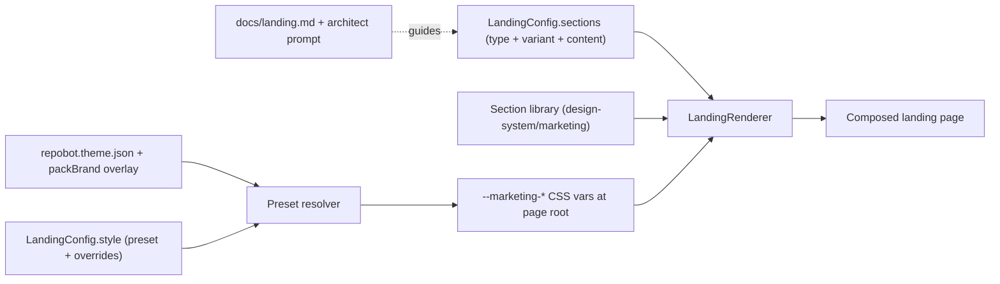

# Landing Page Kernel — Spec (proposal)

Status: **Phases 1–2 implemented; Phase 3 sections and presets shipped**
(section library including `showcase` and `testimonials`, all six presets
`dark-dev` / `soft-saas` / `editorial` / `brutalist` / `warm-boutique` /
`mono-utility`, `LandingConfig` + `LandingRenderer`, `/landing` exemplar,
launch pack recomposed on the kernel, agent recipe at `docs/landing.md`).
This file remains the design record; the remaining Phase 3 work
(the variants still starred in `docs/landing.md`, the screenshot matrix,
pack migrations) is tracked in §7.

Scope decisions locked at the outset:

- **Web-only.** Landing pages, blogs, and static marketing sites are web
  surfaces. No SwiftUI/Compose twins (unlike launch/folio today). The content
  schema is platform-neutral so native ports can be added per-section later
  if ever needed.
- **Client-only by default.** Lead capture stores locally (the proven launch
  pattern) with a documented upgrade path to a real backend inbox via
  `docs/adding-a-domain.md`.
- **Deliverable-first.** This spec precedes implementation; the rollout plan
  at the end sequences the build.

## 1. Why a landing kernel

Every product needs an attractive landing page, and agents currently
reinvent it every time. The kernel already solves this class of problem for
auth, shell, and AI: a reusable surface, config-driven behavior, and a recipe
doc. Landing pages have no equivalent — instead we have:

- **One-off fixed layouts.** The `launch` pack is a complete, good-looking
  SaaS landing page, but its layout is frozen: one nav, one hero, one feature
  grid. `folio`, `link`, `trade`, `menu`, `sugar`, and `blank` are each
  another frozen layout. Six-plus packs independently implement nav, hero,
  cards, CTA, and footer with zero shared code.
- **Page-local marketing UI upstream.** Repobot's own marketing site
  (`View/Marketing/` in the platform repo) and the marketplace site each
  built rich hero/pricing/FAQ/testimonial sections — also page-local, also
  non-reusable. The patterns are proven; the reuse is zero.

The deeper problem is **homogenization**. External research is blunt about
this: AI-generated landing pages converge on the same "median page" — same
skeleton, same Inter-for-everything typography, same card grid — and the
pages that stand out are the ones making deliberate, opinionated choices
(typography, palette, layout rhythm). A kernel that only ships one blessed
layout would make every Repobot project look like every other Repobot
project. The kernel must therefore be built for **variance**: composition
across sections, variants, and style presets, so two projects derived from
it look unrelated.

### Design goals

1. **Fast to derive.** An agent assembles a complete page by writing one
   config + content file — no layout code for the common case.
2. **Looks customized.** Style presets + variant choices + brand overlay
   produce visibly different pages from the same primitives.
3. **Hard to make ugly.** Sections are pre-balanced (spacing, hierarchy,
   responsiveness); presets are curated token sets, not free-form CSS.
4. **Escape hatch preserved.** The existing eject seam (`@ui` registry +
   `Theme/overrides/`) applies unchanged when a section needs bespoke work.
5. **Nameable without a checkout.** Section types, variants, and presets are
   stable string enums the setup architect can reference in its prompt.

## 2. Kernel anatomy

Mirrors the auth/shell/ai precedent — surface, config, binder, recipe:

| Layer       | Location                                                                                | What it is                                                                                                                                                                                                            |
| ----------- | --------------------------------------------------------------------------------------- | --------------------------------------------------------------------------------------------------------------------------------------------------------------------------------------------------------------------- |
| Surface     | `web/design-system/src/marketing/`                                                      | Purely presentational section components (`MarketingNav`, `MarketingHero`, ...), vanilla-extract, one Storybook story per variant. Domain-agnostic: all content injected via typed props.                             |
| Style       | `web/design-system/src/marketing/theme/`                                                | Preset definitions resolved to a `--marketing-*` CSS variable set (the `landingThemeVars` pattern proven on Repobot's own marketing site), scoped to the page root so marketing pages can diverge from the app theme. |
| Composition | `LandingConfig` type (design-system) + `landing.ts` content file (web/app, per project) | Declarative page description: style preset + ordered sections, each `{ type, variant, content }`.                                                                                                                     |
| Binder      | `web/app/src/View/Landing/LandingRenderer.tsx`                                          | Thin mapper from config entries to section components. Owns page-level concerns: anchor ids, smooth scroll, the style-preset var scope.                                                                               |
| Recipe      | `docs/landing.md` + `AGENTS.md` routing row + architect prompt vocabulary               | How agents pick sections, order them, write copy, and choose a preset.                                                                                                                                                |

Rules that carry over unchanged:

- The design system stays pristine (`verify-ds-pristine.mjs`), and so do the
  landing glue (`web/app/src/View/Landing`, minus the authored `landing.ts`
  exemplar) and the manifest-driven pages (`web/app/src/View/Site`); customer
  customization flows through config, tokens, documents, and the eject seam —
  never edits to these trees. Each pristine tree carries its own
  `.pristine-manifest.json`, which is what lets the platform's kernel refresh
  land updates in customer repos mechanically.
- Styling is vanilla-extract from tokens only; no hardcoded colors in
  sections. Preset palettes route through the `packBrand`/`packFont` overlay
  convention so "make it my brand color" flows into every preset without
  touching section code (see `packs/README.md`, "Pack palettes and the theme
  contract").
- A section without a Storybook story is unfinished.



## 3. Section taxonomy and variant matrix

Twenty-three section types cover every landing-relevant surface found in the
internal harvest (Appendix A) and the external canon (Appendix B). Variants
are layout alternatives, not themes — theming is the preset's job. Initial
variant sets below; the matrix grows over time, never shrinks (variant names
are a stable public vocabulary).

| #   | Type            | Job (the doubt it retires)                                | Variants (v1 in bold)                                                                                                                                                                                                              | Content shape (summary)                                                                           |
| --- | --------------- | --------------------------------------------------------- | ---------------------------------------------------------------------------------------------------------------------------------------------------------------------------------------------------------------------------------- | ------------------------------------------------------------------------------------------------- |
| 1   | `nav`           | Orientation: where am I, what can I do                    | **`inline`** (logo + anchors + CTA), **`minimal`** (logo + CTA only), `centered-logo`, `burger-overlay` (mobile-style overlay menu at all sizes)                                                                                   | logo {name, emoji?, tagline?}, links[], cta                                                       |
| 2   | `hero`          | "Is this for my use case?"                                | **`centered-stack`**, **`split-media`** (copy beside visual), **`statement`** (oversized editorial sentence, folio-style), `form-first` (waitlist/lead form in the hero), `product-frame` (CSS browser-chrome around a screenshot) | headline, accent?, subheadline, primaryCta, secondaryCta?, media?, badge?, backdrop?              |
| 3   | `social-proof`  | "Who else trusts this?"                                   | **`text-logos`** (uppercase text strip, launch-style), `metrics-row` (big numbers), `badges`, `marquee`                                                                                                                            | items[] (names, metrics, or badge assets)                                                         |
| 4   | `feature-grid`  | "What does it do for me?" (many parallel features)        | **`cards-3up`**, **`icon-list`** (compact 2-col), `bento` (asymmetric grid with one flagship cell)                                                                                                                                 | kicker, title, features[] {emoji/icon, title, description}                                        |
| 5   | `highlights`    | "Show me, one feature at a time" (few deep features)      | **`alternating`** (text/visual rows that swap sides), **`stacked`** (media above copy, one column)                                                                                                                                 | kicker, title, highlights[] {media?, headline, body, cta?}                                        |
| 6   | `steps`         | "How does it work? Is it hard?"                           | **`numbered-cards`** (launch-style), `timeline` (vertical, accent-per-step), `horizontal-rail`                                                                                                                                     | kicker, title, steps[] {title, description}                                                       |
| 7   | `comparison`    | "How is this different from X?"                           | **`table`** (honest rows, include one you lose; booleans render ✓/—), **`cards`** (each contender column becomes a card, first featured)                                                                                           | kicker, title, columns[] (first = criterion header), rows[] {label, values[] (string \| boolean)} |
| 8   | `testimonials`  | "Do real people vouch for it?"                            | **`quote-grid`**, `quote-carousel` (autoplay, marketplace-proven), `single-featured`                                                                                                                                               | quotes[] {quote, author, title?}                                                                  |
| 9   | `pricing`       | "What does it cost? Which plan is me?"                    | **`tiers`** (2–3 cards, one highlighted, optional monthly/yearly toggle — launch-proven), `single-price`, `table` (feature-by-tier matrix)                                                                                         | tiers[] {name, monthly, yearlyPerMonth, description, features[], highlighted?, badge?}            |
| 10  | `faq`           | Residual objections                                       | **`accordion`** (native `<details>`, launch-proven), `two-column`                                                                                                                                                                  | items[] {question, answer}                                                                        |
| 11  | `showcase`      | "Show me the work / the goods" (portfolio, menu, gallery) | **`card-grid`**, `filterable-grid` (tag chips derived from item tags, folio-proven), `media-rail`                                                                                                                                  | items[] {title, description, tags?, media/emoji+accent, url?}                                     |
| 12  | `cta-banner`    | "Okay — let me act"                                       | **`card`** (bordered panel, launch-style), `full-bleed` (edge-to-edge tinted band), `split-with-form`                                                                                                                              | title, cta, body?, backdrop?                                                                      |
| 13  | `lead-form`     | Capture intent with minimal friction                      | **`inline-email`** (single input + button, local-storage confirm — launch-proven), `contact-block` (email/phone/address + mailto), `detail-form` (name/company/message)                                                            | fields config, cta, confirmation copy                                                             |
| 14  | `footer`        | Housekeeping and trust residue                            | **`single-row`** (blurb + links, launch-style), `columns`, `brand-blurb`                                                                                                                                                           | blurb?, links[], socials?[]                                                                       |
| 15  | `content-split` | One substantial claim, told properly beside a visual      | **`media-right`**, **`media-left`**                                                                                                                                                                                                | kicker, headline, body, bullets?, cta?, media?                                                    |
| 16  | `rich-prose`    | Long-form trust: the story, manifesto, or method          | **`narrow`** (measure-limited ~65ch), **`two-column`** (CSS columns)                                                                                                                                                               | kicker, title, paragraphs[], backdrop?                                                            |
| 17  | `card-grid`     | Parallel offerings (services, use cases, resources)       | **`3up`**, **`2up`**, **`4up`** (fixed column counts with responsive collapse)                                                                                                                                                     | kicker, title, cards[] {media?, title, body, cta?}                                                |
| 18  | `carousel`      | A browsable lineup without the page length                | **`cards`** (a few slides per viewport), **`spotlight`** (near-full-width slides) — CSS scroll-snap, no carousel machinery                                                                                                         | kicker, title, slides[] {media?, title, body?, cta?}                                              |
| 19  | `gallery`       | Visual proof: the work, the space, the product            | **`uniform`** (one aspect on a grid), **`masonry`** (natural heights via CSS columns)                                                                                                                                              | kicker, title, items[] {media, caption?}                                                          |
| 20  | `logos`         | "Which names back this?" — the logo wall                  | **`strip`** (one centered row), **`grid`** (bordered cells); a logo without media renders as a muted wordmark                                                                                                                      | kicker, logos[] {name, media?}                                                                    |
| 21  | `stats`         | Numeric proof at a glance (big accent numbers)            | **`row`** (centered strip), **`cards`** (a surface per number, room for a sentence)                                                                                                                                                | kicker, title, stats[] {value, label, description?}                                               |
| 22  | `team`          | "Who's behind this?"                                      | **`grid`** (centered cells), **`list`** (narrow rows with longer bios) — circular media, emoji fallback                                                                                                                            | kicker, title, members[] {media?, name, role, bio?}                                               |
| 23  | `blog-list`     | The post index: proof the lights are on                   | **`cards`** (media cards on a grid), **`list`** (rule-separated editorial column)                                                                                                                                                  | kicker, title, posts[] {title, date?, excerpt?, href, media?}                                     |

Notes:

- `hero` `form-first` composes the `lead-form` content shape rather than
  duplicating it.
- `backdrop?` (`hero`, `cta-banner`, `rich-prose`) is full-bleed artwork
  behind the section's content: `{ src, alt?, overlay?, position? }`. The
  section breaks out of the page frame to the viewport edges, paints the
  art `object-fit: cover`, and applies a scrim — `soft` (default) veils
  with the theme's page background so copy keeps its theme colors in both
  modes; `dark` is a black gradient for light-on-image treatments; `none`
  trusts the art. This is how art-directed designs (a headline over a
  painted scene, a closing band over a landscape) are realized without
  ejecting a component.
- Every section accepts optional `kicker` (the uppercase accent label) and
  `title` where sensible — the kicker/title/body rhythm is the strongest
  shared pattern across the internal harvest.
- Anchor ids derive from section type (`#pricing`, `#faq`) so `nav` links
  work with zero configuration.

## 4. Style preset system

A preset is **tokens + typography + background treatment + shape + motion +
default variants**. It is the single highest-leverage lever for "looks
customized": research consistently found that typography and palette — not
layout novelty — separate pages that look intentional from pages that look
generated.

### Axes every preset defines

| Axis       | Tokens (emitted as `--marketing-*` vars)                                                                                            | Range                                                                                                                                                                                                                                                                                                                                                                                                                                                                                                                                       |
| ---------- | ----------------------------------------------------------------------------------------------------------------------------------- | ------------------------------------------------------------------------------------------------------------------------------------------------------------------------------------------------------------------------------------------------------------------------------------------------------------------------------------------------------------------------------------------------------------------------------------------------------------------------------------------------------------------------------------------- |
| Palette    | page-bg, surface, line, text, subtle, accent, on-accent, accent-soft                                                                | Every preset ships an authored light AND dark variant; the theme contract's resolved `mode` picks which one applies (the preset's native lean is only the default a pack stamps). Accent defaults from the preset but is overridden by `packBrand`/customer theme                                                                                                                                                                                                                                                                           |
| Typography | display-family, body-family, display-weight, display-tracking, kicker-style                                                         | Uses the existing `repobot.theme.json` `fontFamily` presets (self-hosted: `inter`, `manrope`, `source-serif`, `space-grotesk`, `plex-mono`) — a preset is a _pairing_ (display + body)                                                                                                                                                                                                                                                                                                                                                      |
| Shape      | radius (cards/inputs/buttons), border-width, shadow policy                                                                          | From fully round + soft glow to 0px + 1px hard borders + no shadow. An UNSET contract radius keeps authored geometry untouched; the explicit choices bridge over it (`--marketing-radius-scale` + floors): Sharp zeroes every radius, Soft floors at 8px (`--marketing-radius-floor`) so square-authored presets visibly soften, Round amplifies and takes controls to full pills through their own floor (`--marketing-radius-control-floor`, 999px) while cards floor at 18px — the user's Feel pick wins over the preset's art direction |
| Background | flat, radial-tint (launch's two-blob wash), mesh (4–8 layered radial gradients), grain (inline SVG `feTurbulence` overlay), pattern | Pure CSS — zero image assets (see §6)                                                                                                                                                                                                                                                                                                                                                                                                                                                                                                       |
| Motion     | none, rise-on-load (launch's 480ms rise), scroll-reveal                                                                             | Respect `prefers-reduced-motion`                                                                                                                                                                                                                                                                                                                                                                                                                                                                                                            |
| Density    | section padding scale, max content width                                                                                            | Ties into the theme contract's existing `density`: MarketingPage sets `--marketing-space-scale` (compact 0.65 / comfortable 1 / spacious 1.4) and the section library's authored rhythm — section paddings, grid gaps, card paddings, hero/banner heights AND the hero's text-stack margins (badge → headline → subheadline → CTA, `scaledSpace()` in feelBridge.ts) — calc()s against the factor, so each step visibly re-spaces stacked content. Control paddings and hairline insets stay fixed                                          |

### Named presets (v1 set)

| Preset          | One-line identity                             | Signature moves                                                                                                                                        | Default hero     |
| --------------- | --------------------------------------------- | ------------------------------------------------------------------------------------------------------------------------------------------------------ | ---------------- |
| `soft-saas`     | Light, friendly, gradient-kissed product page | Soft indigo wash, rounded cards with layered shadows, gradient CTA buttons (Repobot marketing lineage)                                                 | `split-media`    |
| `dark-dev`      | Near-black developer/AI tool aesthetic        | `#0a0b0c`-class background, one saturated accent, mesh blob behind the hero only, mono-flavored kickers (launch lineage + the 2026 dark-first default) | `centered-stack` |
| `editorial`     | Paper-and-ink, serif-led, magazine confidence | Display serif headlines, italic accent word, thin rules instead of cards, generous whitespace (folio lineage)                                          | `statement`      |
| `brutalist`     | Deliberately raw, unmistakably human          | 0px radius, 1px hard borders, no shadows, exposed grid lines, stark contrast, uppercase everything                                                     | `statement`      |
| `warm-boutique` | Cream-and-terracotta local-business warmth    | Warm neutrals, large radius, soft accent panels, emoji-forward art (menu/salon lineage)                                                                | `split-media`    |
| `mono-utility`  | Terminal/spec-sheet minimalism                | Monospace display type, table-like layouts, no decoration, accent used only for links and CTAs                                                         | `centered-stack` |
| `aurora-dark`   | Molten dark flagship                          | True-black neutral page, violet-cyan-pink ribbon under film grain, glass cards with inset highlights, glowing CTAs                                     | `centered-stack` |
| `luxe-light`    | Polished fintech-grade light                  | Near-white ground, deep ink type set tight, hairline rules, crisp two-layer elevation, iridescent band grazing the top edge                            | `product-frame`  |

Preset resolution order (customer always wins):

1. Preset defines its full token set (the "art direction").
2. `packBrand`/`packFont` overlay applies when the customer has branded the
   project — accent and font flow in, exactly as packs work today.
3. `LandingConfig.style.overrides` allows targeted var overrides without
   ejecting (e.g. a one-off hero background).

Two projects that pick different presets + different hero/feature variants +
their own accent are visually unrelated while sharing 100% of section code.
That is the kernel's answer to the median-page problem.

## 5. Composition model and content schema

The launch pack proved the single-content-file model: agents (and users
reading diffs) reason about one typed file. The kernel generalizes it —
config and content stay together:

```ts
// web/app/src/View/Landing/landing.ts (per project — this file IS the page)
import type { LandingConfig } from "@base/design-system/marketing"

export const landing: LandingConfig = {
    style: { preset: "dark-dev" },
    sections: [
        {
            type: "nav",
            variant: "inline",
            content: {
                logo: { emoji: "💡", name: "Lumina" },
                links: [
                    { label: "Features", anchor: "features" },
                    { label: "Pricing", anchor: "pricing" },
                ],
                cta: { label: "Join the glow list", anchor: "lead-form" },
            },
        },
        {
            type: "hero",
            variant: "centered-stack",
            content: {
                headline: "Hi, I'm Lumina. Your nights, fully lit.",
                subheadline: "A smart night light that knows the bedtime routine.",
                primaryCta: { label: "Join the glow list", anchor: "lead-form" },
            },
        },
        {
            type: "social-proof",
            variant: "text-logos",
            content: {
                items: ["Bedtime Weekly", "Glow Report", "Dad Joke Digest"],
            },
        },
        // ... feature-grid, steps, pricing, faq, cta-banner, lead-form, footer
    ],
}
```

Schema principles:

- **Sections are optional and reorderable; content shapes are strict.**
  TypeScript catches malformed content at build time; content tests (the
  launch pricing-guard pattern) protect invariants like "yearly price never
  exceeds monthly."
- **Copy conventions are schema, not prose.** One word of the headline gets
  the accent treatment automatically (launch/folio-proven — by default the
  last: "end the sentence on the word you want to pop"), so good art
  direction is a side effect of writing one good sentence. Placement is the
  hero's `accent` grammar (`last-word` | `first-word` | `none`): editorial
  registers may open on the accent, and brutalist/spec-sheet registers may
  drop it for pure typography. Each preset ships its own lean.
- **Media is optional everywhere.** Every section must look finished with
  zero image assets (see §6). Media slots accept an emoji-on-accent panel, a
  CSS-framed screenshot, or an image path, and degrade gracefully.

### Copy and ordering guidance (goes in `docs/landing.md`)

- The canonical order — hero, social proof, features, testimonials, pricing,
  FAQ, final CTA — is the starting skeleton, but **each section must retire
  one specific doubt**; if two sections answer the same doubt, merge them.
- Sequence is an argument that depends on trust: new-category products show
  the product early (`highlights` before `testimonials`); products in
  crowded categories lead with `comparison` and surface pricing sooner.
- One primary CTA, repeated (nav, hero, cta-banner, lead-form) — never five
  competing actions.
- Headline: under ~10 words, names a specific outcome for a specific person.
- FAQ answers the objections a skeptical buyer actually has (cancellation,
  security, migration, setup effort) — never "what is your product?"

### Business-type blueprints

The recipe ships recommended section stacks so agents don't start from a
blank config:

| Business type                          | Recommended stack                                                                                                                           | Preset lean                |
| -------------------------------------- | ------------------------------------------------------------------------------------------------------------------------------------------- | -------------------------- |
| SaaS / app                             | nav, hero, social-proof, feature-grid, steps, testimonials, pricing, faq, cta-banner, lead-form, footer                                     | `dark-dev` or `soft-saas`  |
| Local business (café, salon, services) | nav, hero (`split-media`), showcase (menu/services), social-proof (`metrics-row` reviews), steps?, lead-form (`contact-block`), faq, footer | `warm-boutique`            |
| Portfolio / personal                   | nav (`minimal`), hero (`statement`), showcase (`filterable-grid`), highlights (about), lead-form (`contact-block`), footer                  | `editorial` or `brutalist` |
| Agency / studio                        | nav, hero (`statement`), showcase, testimonials, steps (process), comparison?, lead-form (`detail-form`), footer                            | `editorial`                |
| Pre-launch / waitlist                  | nav (`minimal`), hero (`form-first`), feature-grid, faq, footer                                                                             | any                        |

## 6. Imagery strategy

Generated projects start with zero assets, so the kernel treats imagery as a
ladder — every rung looks finished, each rung up looks better:

1. **Typography-led (no visuals).** The 2026 baseline: oversized display
   type _is_ the hero visual. `statement` heroes and the `editorial` /
   `brutalist` presets are designed for this rung.
2. **Pure-CSS backgrounds.** Layered radial gradients (the mesh technique:
   4–8 semi-transparent `radial-gradient` layers on a base color — the
   Stripe/Linear look), plus optional grain via an inline SVG
   `feTurbulence` data-URI on a pseudo-element. Zero bytes of image assets,
   resolution-independent, themable from preset tokens. Launch's two-blob
   radial wash is the existing in-kernel example.
3. **Emoji-on-accent panels.** Folio-proven: an emoji on an accent-tinted
   rounded panel reads as deliberate art direction, not a placeholder. The
   default media slot for cards and showcase items.
4. **CSS product frames.** A CSS-drawn browser-chrome / device frame around
   a real screenshot of the project's own app — the single strongest hero
   visual for product pages, and the screenshot can be added later without
   layout changes.
5. **Generated images.** In the Repobot sandbox, agents already generate
   images and save them to `web/app/public/` (per `AGENTS.md` sandbox
   rules). The recipe adds guidance: generate backgrounds/illustrations in
   the preset's palette; prefer abstract over literal; never stock-photo
   pastiche.
6. **Real assets.** Customer-supplied photos/logos drop into the same media
   slots.

## 7. Rollout plan

**Phase 1 — core library (the build).** The v1 cut: 10 section types (the
launch set: nav, hero, social-proof, feature-grid, steps, pricing, faq,
cta-banner, lead-form, footer) with the bold variants from §3; three presets
(`dark-dev`, `soft-saas`, `editorial`); `LandingConfig` + `LandingRenderer`;
a Storybook story per variant. Exit criteria: the current launch page is
byte-for-byte reproducible as a config.

**Phase 2 — launch pack refactor + recipe.** Rewrite `packs/launch` on the
kernel (its `content.ts` becomes a `landing.ts`; its styles file is
deleted). Write `docs/landing.md`; add the `AGENTS.md` routing row
("Landing page, marketing site, waitlist → `docs/landing.md`"); add the
section/variant/preset vocabulary and business-type blueprints to the setup
architect prompt (which has no checkout and needs nameable enums). Native
launch views remain as-is (web-only scope).

**Phase 3 — breadth.** Remaining sections (highlights, comparison,
testimonials, showcase) and variants; remaining presets (`brutalist`,
`warm-boutique`, `mono-utility`); a screenshot matrix (variant x preset)
generated from Storybook as the visual QA gate and, eventually, a visual
reference sheet for the architect. Opportunistically migrate the other
landing-shaped packs (`blank`, `link`, `trade`, `menu`, `sugar`) as they
next need work — each migration deletes a bespoke styles file and hardens
the kernel.

_Phase 3 progress:_ shipped — `showcase` (`card-grid`, `filterable-grid`),
`testimonials` (`quote-grid`), the `metrics-row` (social-proof), `timeline`
(steps), `contact-block` (lead-form), and `product-frame` (hero) variants,
and the `brutalist` / `warm-boutique` / `mono-utility` presets. Also
shipped: `highlights`, `comparison`, and the breadth sections 15–23 in §3
(`content-split`, `rich-prose`, `card-grid`, `carousel`, `gallery`,
`logos`, `stats`, `team`, `blog-list`), each with all listed variants. Pack
migrations landed: `blank`, `talk`, `trade`, `menu`, `sugar`, and `folio`
now compose the kernel (each deleted its bespoke styles file — see
Appendix A for the per-pack outcomes and the packs that deliberately stay
bespoke). Still open — the variants still starred in `docs/landing.md` and
the screenshot matrix.

**Quality gates throughout:** content tests per section family (launch's
pricing guard generalized); `prefers-reduced-motion` honored by every
motion token; responsive behavior owned by sections, never by configs;
pristine-design-system verification unchanged.

### Open questions (not blockers for Phase 1)

- **Multi-page marketing sites.** _Resolved by the project IA layer_
  (`docs/project-ia.md`): `repobot.project.json` declares a
  `marketing.pages` list (one preset, one page-blueprint or inline
  `LandingConfig` per entry), and the app renders public routes from it at
  runtime — the `pages: Record<route, LandingConfig>` idea, landed as a
  committed manifest instead of a code-level map. See the §8 page-blueprint
  vocabulary.
- **Preset location.** Presets could eventually live in
  `repobot.theme.json` (a `landing.preset` key) so re-branding flows
  through one file; v1 keeps them in `LandingConfig.style` to avoid a theme
  contract change before the shape is proven.
- **Native.** If a landing-shaped pack later needs native parity, the
  content schema ports (launch/folio already mirror content constants
  natively); the section library does not. Revisit only on demand.

## 8. Setup-flow integration contract

The project setup flow (platform repo: `ProjectSetupService.ts` architect +
the onboarding wizard) is a separate workstream. The two efforts stay
decoupled by making the coupling surface explicit and tiny:

**The public surface is the vocabulary — strings only.** The setup flow may
depend on:

- section type names (`nav`, `hero`, `social-proof`, ... — §3)
- variant names per section (`centered-stack`, `statement`, ... — §3)
- shell chrome variant names: nav `inline` / `centered` / `burger-overlay`
  / `full-width` / `split` / `pill-links` / `logo-only`, footer `simple` /
  `multi-column` / `newsletter` (`MarketingShell`; the `nav`/`footer`
  _section_ types stay renderable for pre-shell configs). The nav default
  is themeable: `repobot.theme.json` → `navigation.variant` (kernel
  default `full-width`). Nav links may carry hover mega-menus
  (`MarketingNavLink.menu` — titled columns of described links).
- preset names (`soft-saas`, `dark-dev`, `editorial`, `brutalist`,
  `warm-boutique`, `mono-utility` — §4)
- blueprint names / stacks per business type (§5)
- the coarse `LandingConfig` shape: a page is a preset plus optional shell
  chrome plus an ordered list of `{ type, variant, content }` entries
- **page-blueprint names** in `repobot.project.json`'s `marketing.pages`
  (`landing`, `pricing`, `about`, `contact`, `faq`, `custom`) and
  **dashboard-blueprint names** in `dashboard.destinations` (`overview`,
  `table`, `settings`, `custom`) — the project IA vocabulary
  (`docs/project-ia.md`), governed identically (append-only)

**Guarantees.** The vocabulary is append-only: names are never renamed or
removed once shipped (new variants/presets may be added; per-preset default
variants may change). This is the same stability promise the shell kernel
makes for its `top-nav` / `sidebar` / `minimal` keys, which the wizard's
`AppShellStep` already depends on.

**What the setup flow must never depend on:** section component props,
`--marketing-*` token names, file layout inside
`web/design-system/src/marketing/` — all internal and free to change.

**What this enables (neither side blocks the other):**

- The architect prompt gains a landing vocabulary block (section/variant/
  preset enums + blueprints) so plans can say "use the `editorial` preset
  with a `statement` hero" instead of describing layouts in prose. If the
  setup workstream is restructuring how the prompt acquires kernel
  knowledge, prefer a data-driven per-kernel vocab block over another
  hand-written paragraph — the landing block will be the third such block
  (after shell and auth) and won't be the last.
- The wizard may add a landing style step (a preset picker), following the
  `AppShellStep` pattern exactly: a fixed set of keys, previews per key,
  the chosen key handed to the agent. Preset names are the entire contract.
- Nothing else moves: `TemplateRegistry`, the `repobot-launch` template
  key, compose, and the deploy manifest are unaffected by the kernel (§7
  Phase 2), so provisioning needs no coordination.

---

## Appendix A — Internal pattern harvest

What already exists, and what the kernel absorbs from each source.

### `packs/launch` (LaunchBot) — the strongest precedent

- Full SaaS page: inline nav, centered hero + waitlist form, text-logo trust
  strip, 3-up feature cards (emoji art), numbered step cards, 3-tier pricing
  with monthly/yearly toggle + highlighted tier + badge, `<details>` FAQ
  accordion, card CTA, single-row footer.
- **Single typed `content.ts`** drives everything — the model §5
  generalizes.
- Styling: deep-navy palette + gold accent routed through
  `packBrand`/`packFont`; two-blob radial-gradient page wash; rise-on-load
  keyframe; accent-last-word headline; uppercase kickers; `aria-pressed`
  billing toggle; content tests guard pricing sanity.

### `packs/folio` (Folio) — the editorial counterpoint

- Serif hero statement (italicized last word), availability badge,
  filterable project grid (tag chips derived from item tags),
  **emoji-on-accent card artwork** (finished look with zero images), skills
  cloud, mailto contact.

### Other landing-shaped packs

`blank` (simple landing), `link` (link-in-bio), `trade` (business site),
`menu` (café site with filters + open/closed badge), `sugar` (retail landing
with rotating menu) — five more independent implementations of nav / hero /
cards / contact, all candidates for Phase 3 migration.

**Migration outcomes (Phase 3):**

- Migrated onto the kernel: `blank` (soft-saas, single hero — the minimal
  config), `talk` (dark-dev), `trade` (editorial; KPI strip →
  `metrics-row`, shipment board → a second `showcase`), `menu`
  (warm-boutique; live open/closed badge computed into the hero per render,
  prices on the showcase `meta` slot, hours table → contact-block
  channels), `sugar` (warm-boutique; rotating case and live machine
  statuses computed into the config per render), `folio` (editorial;
  filterable grid → `showcase filterable-grid`). Dynamic copy is fine: a
  pack config file may be a `build(now)` function — the config is data,
  when it's computed is the pack's business.
- `shop` stays bespoke: its buy button starts checkout via the
  `createCheckoutSession` mutation and redirects to the returned URL, but
  `MarketingCta` is anchor/href-only (sections render plain `<a>` tags —
  no onClick/action affordance) and `LandingSection` is a closed union with
  no custom-section/children escape hatch. Migrate it if/when the kernel
  grows a CTA action or custom-section seam; never weaken the payment flow
  to fit the vocabulary.
- `link` stays bespoke by design: the pack ships its own theme system
  (per-profile palettes) that would fight the preset contract.
- `blog` stays bespoke by design: it is a multi-page reader (post routes),
  not a landing page; revisit with the multi-page open question in §7.

### Repobot marketing site (platform repo, `View/Marketing/`)

- `MarketingPageShell` applying `landingThemeVars` — the direct precedent
  for the `--marketing-*` scoped-CSS-var approach.
- `MarketingHeader` (sticky nav + mobile slide-out), `AnnouncementBar`,
  prompt-card hero with `RotatingPromptTextarea`, `BuildFlowSection`
  (timeline steps with per-step accents), `ComparisonSection` (featured
  column), `BuiltForSection` (card rail), pricing page with billing toggle +
  reassurances, FAQ accordions, `BottomCtaSection`, `ProductCtaBannerSection`
  (full-bleed CTA), `AuthShell` split layouts.

### Marketplace site (`marketplace/typescript/web`)

- Full-bleed **video hero** with copy overlay and partner logo strip,
  scroll-aware navbar with burger overlay + slide-in `GetStartedForm`
  (detail-form precedent), `QuoteCarousel` testimonials, `HighlightGrid`
  media tiles, arrow/underline CTA buttons, Georgia/Tektur editorial type
  pairing — evidence that typography pairing alone re-brands a page.

### Theme infrastructure already in the kernel

- `repobot.theme.json` contract (brand, radius, density, fontFamily, mode)
  with build-time derivation and native codegen.
- `packBrand`/`packFont` overlay: pack art direction that yields to customer
  branding — the exact mechanism presets reuse.
- Self-hosted font presets spanning sans/serif/grotesk/mono — enough raw
  material for all six preset type pairings without new fonts.

## Appendix B — External research findings

Distilled from 2026-era landing page analyses, pattern libraries, and design
trend reports (SaaS section-anatomy studies, hero-layout taxonomies,
Landdding/Muzli/agency trend reports, CSS technique guides).

- **The canonical anatomy is stable.** Across ~100-page analyses: hero
  (100%), features (97%), social proof (89%), final CTA (84%), pricing
  (72%), FAQ (61%) — in nearly fixed order matching the buyer's cognitive
  sequence (what is this → who trusts it → what does it do → what does it
  cost → my objection → act). Validates the taxonomy and default ordering.
- **But the median order is "optimal for nobody."** Section order is an
  argument; effective pages re-sequence around the visitor's dominant doubt
  (show-first for new categories, comparison-first for crowded ones). Each
  section should retire exactly one doubt. This is recipe guidance, not
  component design.
- **Differentiation is typography and palette, not layout novelty.** The
  cited difference between pages that look intentional and pages that look
  generated is type investment (display serifs, grotesks, mono-as-display)
  over default sans. Dark-dominant palettes with a single saturated accent
  are the tech-category default; gradients are applied surgically (one hero
  blob, the CTA) rather than everywhere.
- **Current style archetypes** worth encoding as presets: dark-first
  dev/AI-tool minimalism; editorial serif long-form (returning for
  trust-heavy categories, converts well for complex products); tactile
  brutalism (0px geometry, 1px borders, no shadows, exposed grids) as the
  anti-AI-slop signal; typography-as-interface (viewport-scaled display
  type replacing hero imagery).
- **Hero layout taxonomy** converges on: centered stack, split (text +
  media), product-showcase (screenshot/dashboard framing), statement
  (type-led), bento (asymmetric grid, one flagship cell), full-bleed media.
  Bento and scroll-tied heroes are trendy but higher-risk; v1 ships the
  evergreen four.
- **Zero-asset visuals are a solved problem in CSS.** Mesh gradients = 4–8
  layered semi-transparent `radial-gradient`s on a base color; grain = inline
  SVG `feTurbulence` filter as a data-URI (applied to a pseudo-element,
  10–25% strength); both lightweight, resolution-independent, and derivable
  from preset tokens at runtime.
- **Conversion mechanics to encode as defaults:** one primary CTA repeated;
  outcome-naming headlines under ~10 words; 3-tier pricing with the middle
  tier highlighted and an annual toggle showing savings; 5–8 FAQ items
  answering real objections; a final CTA block above the footer.
